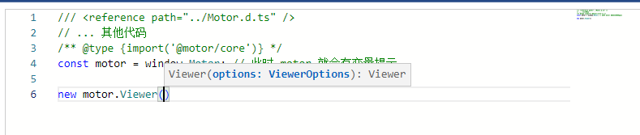

# Luban MotorSDK 图形引擎使用指南
## 引入方式 3 种
### 1 从 npm 安装
```bash
npm i luban-motor-sdk # 通过 npm 仓库
npm i ./luban-motor-sdk.tar.gz # 通过本地文件压缩包
npm i ./luban-motor-sdk # 通过本地文件夹
```

### 2 从 script 标签引入
> 
```js
<script src="https://xxx.xxx.xx/luban-motor-sdk/v.1.4.3/Motor.js"></script>
```

### 3 通过 webpack 模块联邦
```js

```


# 缺失IDE提示
## script 标签的方式引入的或者通过 webpack 模块联邦引入的可能存在 IDE 提示缺失的问题


> 需要把 Motor.d.ts (可以从更新日志里面下载) 文件放到项目中
```js xxx.js
/// <reference path="../Motor.d.ts" />
// ... 其他代码
/** @type {import('@motor/core')} */
const motor = window.Motor; // 此时 motor 就会有变量提示
```

