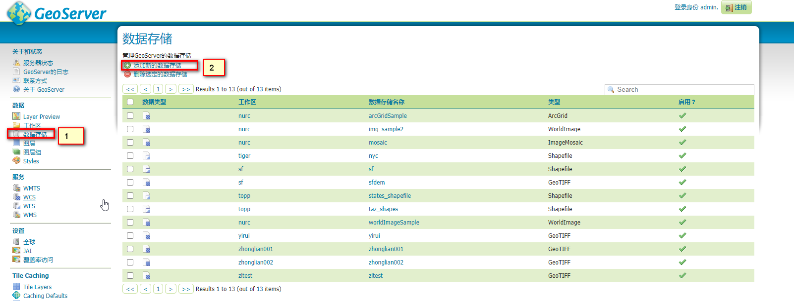

# 概述

## Luban Motor介绍

1. 领先的专业BIM轻量化引擎+城市信息模型应用开发技术平台。
2. 建筑行业的软件开发者可在Motor所提供的基础功能上进行二次开发，为终端用户提供更加丰富、更有价值的BIM应用。
3. 应用场景-BIM模型建完之后，聚焦于模型的浏览与管理，主要是帮助用户最大化的利用发挥模型的应用价值。

## Luban Motor核心能力

Motor解决： 常用主流的BIM模型的解析兼容、BIM数据的存储读取、BIM模型的可视化、BIM模型状态编辑应用交互等专业技术问题；

降低BIM技术应用研发的技术门槛；

您只需要专注聚焦于业务功能的研发。

## Luban Motor主要优势

1. **功能丰富** ： Motor提供了丰富的JS API接口，使用简单，支持解析兼容多种结构化专业BIM建模软件的数据格式和部分通用3D建模渲染领域内的数据格式（FBX、GLTF等），并且不断完善解析的完整度。使得客户在模型展示和BIM数据方面有很大的发挥空间。
2. **超强渲染性能**：当前市面上对大场景BIM模型支持比较友好、性能较好的一款BIM渲染引擎。采用独立自主的BIM轻量化技术和高性能渲染数据调度算法，能够支持15亿+三角面片流畅渲染以及各种动画交互，利用BIM+CIM的LOD金字塔策略，实现大数据的分级加载。
3. **多元异构融合（GIS的融合）**：通过自主研发的数据模型算法，对矢量、地形、影像、BIM、倾斜摄影等二三维数据进行融合，制定了一体化的数据规范，解决了二三维数据统一传输、解析和展现的三大瓶颈。并且支持所有项目上自定义的工程坐标系，实现数据的无缝对接和转换。
4. **便捷的场景整合工具**：提供一整套，完全WEB端的用于场景中模型的增删改等编辑的可视化交互工具，能便捷的将各种创建的离散二三维数据模型归类整合成完整的应用场景
5. **专业技术支持和服务**：   聚焦图形与BIM技术，竭尽全力实现客户价值，技术沟通微信群全天候24小时线上支持。

# 开发前准备

## 创建应用

1. 打开鲁班Motor官网，注册账号

2. 进入控制台（https://lbdp.lubansoft.com/center-new/index.html），登录

3. 进入控制台页面如下，已经存在一个应用授权，记住AppID和AppSecret，后面的开发需要应用到此授权信息。


## BIM数据转换

1. 如果已有的模型格式是RVT,PDS,DWG,FBX格式模型 忽略此节。
2. 如果是bently等模型，下载原建模软件，然后下载鲁班万通插件安装，通过插件一键导出PDS模型

# 快速搭建一个模型应用

## 场景制作（以RVT文件为例）

**场景制作已经场景整合编辑可以参照一下视频：**

https://pan.baidu.com/share/init?surl=jqhLt4Bo91_eiT6Q4hPCng

提取码：99ru

具体步骤：

1. 登录控制台（https://lbdp.lubansoft.com/center-new/index.html），选择模型管理页签

2. 点击“新增模型”按钮，选择应用APP，选择待上传的RVT文件，点击 新增，开始提示上传转换中，稍后转换成功完成
3. 点击列表中新建的 模型，打开新页面预览模型效果 
4. 点击左侧工程管理，点击新建工程，自行输入工程名称，选择工程项目位置（省市区），这个尽量输入最近位置。然后选择对应的应用管理权限
5. 点击列表新建的工程，打开页面预览，或者点击操作栏中的“编辑”，打开页面进入工程编辑状态模式，可以在编辑状态下，添加模型，GIS，移动位置等操作，具体参见相关操作视频教程
6. 注意编辑状态操作完成后需要点击页面上的保存按钮

## 加载场景

在上述，已经完成了模型的上传和工程的创建整合。

应用端集成Motor组件，加载预览工程的步骤：

1. github上下载motor SDK组件开发包

   https://github.com/lubansoft-developer-platform/Motor-SDK

   上述链接下载后里面 “motor-sdk”的目录为motor的二次开发工具包

2. 创建HTML文件

   创建一个简单的html页面（index.html），如下：

```html
<!DOCTYPE html>
<html lang="en">
<head>
  <meta charset="UTF-8">
  <meta http-equiv="X-UA-Compatible" content="IE=edge">
  <meta name="viewport" content="width=device-width, initial-scale=1.0">
  <link rel="stylesheet" href="./motor-sdk/Motor.css">
  <script src="./motor-sdk/Motor.js"></script>
  <title></title>
</head>
<body>
  <div id="motorContainer" style="color: #eee;font-family: sans-serif;font-size: 9pt;display: block;position: absolute;top: 0;left: 0;border: none; width: 100%;height: 100%;">
  </div>

</body>
<style>
  html,body,#motorContainer{
    width: 100%;
    height: 100%;
    padding: 0;
    margin: 0;
  }
</style>
<script>
  Motor.setBaseUrl('./motor-sdk')
  const appId = 'd0b3c61c6639434e84900b1fd8d391cb'
  const secret = '459dc8b77a63a0c009aec27f818febf6'
  const projectId = 'cd35af5eaed64d6a88619d55584e8311'
  const serverUrl = 'https://open.lubansoft.com/api'
  let currentProject = undefined
  function InitViewer() {
      const viewer = new Motor.Viewer({
        container: 'motorContainer',
        baseUrl: serverUrl,
        appId: appId,
        secret: secret,
      })
      return viewer
    }
    const openProj = async (projId) => {
      const viewer = InitViewer()
      await viewer.Init()
      currentProject = await viewer.queryProject(projId)
      await currentProject.open()
      if(currentProject.viewPosition){
        viewer.camera.setViewToViewPosition(currentProject.viewPosition)
      }else{
        viewer.camera.setViewToProject(currentProject)
      }
    }
    openProj(projectId)
</script>
</html>

```

3. 如上html， 首先将motor-sdk目录需要一起发布
4. 引入motor.js和motor.css

```html
 <script src="./motor-sdk/Motor.js"></script>
 <link rel="stylesheet" href="./motor-sdk/Motor.css">
```

5. 设置motor内部引用的静态资源路径

```js
Motor.setBaseUrl('./motor-sdk') ///< 后面的路径就是motor-sdk的包路径
```

6. 初始化View并且加载场景工程

```js
/// 创建viewer对象
const viewer = new Motor.Viewer({
        container: 'motorContainer', ///< 挂载的DOM元素id
        baseUrl: serverUrl, ///< 服务器地址
        appId: appId, ///< 应用的appId
        secret: secret, ///< 应用的secret
      })
/// 初始化
await viewer.Init()
```

7. 查找工程，打开预览工程

```js
///< 查询指定工程或者查询所有工程列表
currentProject = await viewer.queryProject(projId)
///< 打开工程
await currentProject.open()
```

## API功能接口简述

此章具体可详见：

https://lbdp.lubansoft.com/code-box/motor/index.html （在线SDK DEMO案例）

https://lbdp.lubansoft.com/reference/v3.0/motor-web-api/index.html （API在线文档）

### 概念术语解释 

1. 模型（Model）

   - 数据从本地到服务一次上传转换，就是生成一份模型；

     - 比如上传一个rvt文件到服务器，就是生成了一个模型节点，这个rvt转换的结果就是一份对应的模型对象；

     - 比如上传一份地形或者卫片到服务器，就生成一个模型节点，这个地形或者卫片就是一份对应的模型对象；

     - 比如在模板管理中上传一个fbx作为模板实例资源，就生成一个模板实例的模型对象，一份模板实例资源就是一个模型对象；

- 模型节点是可以无限生成添加的。可以上传无数的rvt等模型对象到服务器；
  - 模型对象是不可以通过motor-sdk的js api打开预览的（只可以在控制台单独打开预览）

2. 工程（Project）

   - 上述模型对象是离散的，是不可通过api加载预览的。工程就是承载模型的容器；
   - 在工程中可以添加任意的模型对象，模型对象在工程中被可以添加，删除，替换，移动等；
   - 工程节点数量和部署服务的授权节点数量有关，不能超过部署服务中节点数量；
   - 基于Motor的应用开发，至少需要一个工程；
3. 模型（Model）类型
   - FOLDER： 模型集合（对应编辑器中模型集合节点）
   - BIM：bim模型（rvt，pds，dwg，fbx等模型管理中的对象实例）
   - DOM：卫片模型（模型管理中的gis模型中的卫片对象实例）
   - DEM：地形模型（模型管理中的gis模型中的地形对象实例）
   - TILEPG：倾斜摄影（模型管理中的gis模型中的倾斜摄影对象实例）
   - RESOURCE：模板资源实例（在工程中通过布置模板库中模板构件的实例对象）
   - MASK：掩膜对象（对倾斜摄影绘制掩膜生成的实例对象）
   - WATER：水域对象（在工程通过绘制水域生成的实例对象）
   - HOLE：洞对象（在工程中对地形挖洞生成的实例对象）
   - PGPLAN：压平对象（在工程中对倾斜摄影进行压平生成的实例对象）
   - GLOBEFOLDER：DOM和DEM对象的父类集合对象（工程中所有的dom和dem共有一个父类节点就是此节点）
   - CZML：czml对象（通过api接口-MarkCollectionEditor 动态创建的czml实例对象）
4. BIM构件（Element）
   - 上述模型中只有类型为BIM的bim模型对象中有BIM构件元素，其他所有类型的model，模型本身就是一个构件。

### 视图操作

1. 初始化视图对象
2. 定制鼠标事件
3. 定制视图平移、缩放、旋转模式
4. 修改背景色添加背景图片
5. 开启边线、捕捉点
6. 漫游

### 视角定位

1. 通过编辑器中绑定视角来定位

   ```js
   /// viewposition可以通过proejct对象获取 project.viewPosition
   viewer.camera.setViewToViewPosition(viewposition)
   ```

2. 通过包围盒来定位

   ```js
   /// box: 可以通过model或者project对象获取box信息
   /// phi: 水平朝向角 0表示正北方向
   /// theta： 上下俯仰角 0表示水平向前
   /// durationTime: 飞行定位过程时间
   viewer.camera.setViewToBox(box: undefined | Box, phi?: number, theta?: number, durationTime?: number, completeFunc?: () => void)
   ```

3. 通过二维屏幕上框选区域老定位

   ```js
   /// winPt1: 二维屏幕上第一个点
   /// winPt2: 二维屏幕上第二个点
   viewer.camera.setViewForWinRect(winPt1: Vector2, winPt2: Vector2)
   ```

### 查询

1. 查询工程

   ```js
   /**
      * 查询工程
      * @param {string[]|undefined} projectIds - 工程id，不传 获取当前场景下所有工程列表
      * @returns {Promise<Project[]>} - 返回工程列表
      * @memberof Viewer
      */
     viewer.queryProject(projectIds?: string | string[]): Promise<Project | Project[] | undefined> 
   ```

2. 打开工程

   ```js
   interface ProjectOpenOption {
     // 是否按需加载
     isDrawAllModel: boolean
     // 按需加载的时候 需要加载的工程
     drawingModelList: string[]
   }
   /**
      * @openOption {ProjectOpenOption} 控制参数
   */
   project.open(openOption?: ProjectOpenOption)
   ```

3. 查询模型对象

   ```js
   /**
      * 查询模型对象
      * @param {string | string[] | ModelType[]} - 模型id | 模型id数组 |模型类型 获取工程下所有模型列表
      * @returns {Promise<Model[]>} - 返回模型对象列表
      * @memberof Project
      */
   project.queryModel(param?: string | string[] | ModelType[]): Promise<Model | undefined | Model[]>
   ```

4. 查询bim构件

   ```js
   /**
      * 获取所有构件的id信息列表
      * @returns {Promise<string[]>}
      */
     project(or model).queryElement(): Promise<string[]>
     /**
      * 根据构件id信息获取构件详细信息
      * @param {string} id - 构件id信息
      * @returns {Promise<Element>}
      */
     project(or model) queryElement(id: string): Promise<Element | undefined>
     /**
      * 根据构件id数组，查询构件详细信息列表
      * @param {string[]} ids - 构件id数组
      * @returns {Promise<Element[]>}
      */
     project(or model) queryElement(ids: string[]): Promise<Element[]>
     /**
      * 根据模型bim工程的部位树数组 查询获取构件id列表
      * @param {string[][]} dirs - 模型bim工程部位树数组，例如 [[1楼,revit,墙,剪力墙]]，表示查询  1楼/revit/墙/剪力墙 组织结构下的所有构件
      * @returns {Promise<Element[]>}
      */
     project(or model) async queryElement(dirs: string[][]): Promise<Element[]>
   ```

5. 查询bim模型部位树

   ```js
   interface DirTree {
      name: string;
      children?: DirTree[];
   }
   /**
      * 获取bim模型的部位树
      * @returns
      */
   model.getBimDirTree(): Promise<MotorCore.DirTree | undefined> 
   ```

6. 查询bim构件属性信息

   ```js
   // 首先调用上述查询bim构件接口
   // 然后获取的element对象中有bimProperties属性，即是bim构件的属性
   interface Element {
     model: Model
     // 名称
     name: string
     // 工程id
     projectId: string
     // 模型id_index 只有bim 构件的时候有效
     box: MotorCore.Box
     id?: string
     // 部位树路径 只有bim 构件的时候有效
     dir?: string[]
     // 只有bim 构件的时候有效
     bimId?: string
     properties?: unknown
     // bim构件属性信息
     bimProperties?: unknown
   }
   ```

7. 查询模型和bim构件的自定义id信息

   ```js
   /// 获取bim构件的自定义id信息
   model.getElementCustomId(elementId: string): Promise<string> 
   /// 获取模型的自定义id信息
   model.getCustomId(): Promise<string>
   ```

8. 鼠标捕获对象

   ```js
   interface PickObject {
     /**
      * 模型对象
      */
     model: Model
     /**
      * bim 构件id，非bim构件 id为undefined
      */
     id?: string
     /**
      * 目录树
      */
     dir?: string[]
     /**
      * bim GUID
      */
     bimId?: string
     /**
      * 包围盒
      */
     box?: MotorCore.Box
   } 
   viewer.pick(windowPosition: MotorCore.Vector2): PickObject | undefined 
   
   ///< 备注： 上述，当pick的对象是模型对象时，id dir bimId box属性为undefined
   ```

9. 获取构件或者模型包围盒

   ```js
   /// 获取模型对象的box
   model.getBoundingBox()
   /// 获取构件的box
   model.getElmentBoundingBox(id: string)
   ```

### 状态编辑

1. 修改颜色或者透明处理

   ```js
   /// 模型或者整个工程 设置颜色
   project(or model).setColor(color: Color)
   /// 根据模型或者构件id设置颜色
   project(or model).setColor(color: Color, id: string)
   /// 根据模型或者构件id设置颜色
   project(or model).setColor(color: Color, ids: string[])
   /// 根据BIM部位树节点设置颜色
   project(or model).setColor(color: Color, dirs: string[][])
   project(or model).setColor(color: Color, comps: Element[])
   ```

   

2. 构件隔离

   ```js
   /// 隔离构件
   project.solate(id: string)
   project.isolate(ids: string[])
   /// 按照部位树隔离构件
   project.isolate(dirs: string[][])
   project.isolate(comps: Element[])
   
   /// 注意： 隔离构件默认的屏蔽的透明色是： Color(1, 1, 1, 0.1)；
   /// 可以通过 viewer.blockColor = new Motor.Color(r,g,b,a) 自定义屏蔽色
   ```

3. 模型位置移动、缩放、旋转

   ```js
   /// 按照制定向量平移
   model.translate(offset: Vector3)
   /// 按照制定轴旋转一定角度 
   model.rotate(angle: number, axis: Vector3)
   /// 缩放
   model.scale(scale: Vector3)
   ```

4. 模型或者构件显隐

   ```js
   project(or model).setVisibility(show: boolean)
   project(or model).setVisibility(show: boolean, id: string)
   project(or model).setVisibility(show: boolean, ids: string[])
   project(or model).setVisibility(show: boolean, dirs: string[][])
   project(or model).setVisibility(show: boolean, comps: Element[])
   ```

    备注：上述仅列举部分示意功能接口。详细见：

   https://lbdp.lubansoft.com/code-box/motor/index.html （在线SDK DEMO案例）

   https://lbdp.lubansoft.com/reference/v3.0/motor-web-api/index.html （API在线文档）

   

# 相关工具教程

## 鲁班万通（Trans） 

注意：安装插件，需要先安装BIM建模软件，比如安装鲁班万通（Revit版），需要先安装Revit软件。  这里虽然以Revit转pds为例， 实际上revit模型文件可以直接上传到motor平台，可以省略掉转pds步骤。

​	1.下载地址：http://www.lubansoft.com/product/view/4

​		

2.完整包 和 升级（以Revit万通为例）：

​	2.1：首先必须有完整包（即使是第一次安装前提是本机安装了完整包）：

​			

​	2.2：版本更新方式一：安装补丁（没有完整包后缀的都是补丁文件）

​			

​	2.3：版本更新方式二：在线升级

​	2.4：报错提示（原因：没有安装完整包直接安装补丁）

​			

3.安装过程：

3.1：双击完整包，等待运行完成 后点击下一步

​			

3.2：接受许可，然后选择下一步

​			

3.3：安装路径默认即可，虽然是C盘，该插件占用空间并不大（避免出错），下一步

​			

3.4：选择 安装 软件会自动去寻找revit目录，为保证你可以找到，避免电脑存在多个版本（目前插件支持18.19两个版本留其一）

​		

4：使用过程：

4.1：revit运行后授权：（选择总是载入）

​		

4.2：登陆账号（手机号免费注册）

​		

4.3：升级版本（检查更新）

​		

4.4：选择升级后要退出revit避免程序运行，无法覆盖安装（如果多次重试无效，点退出然后再上一级窗口点击开始更新）

​		

4.5：选择合适功能，导出想要的格式文件


​		

## DEM（高程/地形）数据发布

一、Dem高程数据（需tif格式）处理为软件内部数据格式：

1. 地形处理工具下载 	https://pan.baidu.com/s/1db1-rgeQLXx5f2pv833M3A 	提取密码：xpos

2. 解压后选择trans_dem文件夹：

​		

3. 运行cmd并切换到trans_dem目录输入命令

​		"LBSmartConsole.exe" -terrain_cvt=true -terrain_input=**高程文件所在路径** -terrain_output_dir=**转换后地形输出路径**

4. 命令解释：-terrain_cvt=true（是否开启geotif生成地形，选择true）

5. 以本地D盘D：/test/dem.tif为例，输出在D：/output文件夹，

​	（那么命令为:"LBSmartConsole.exe" -terrain_cvt=true -terrain_input="D:/test/dem.tif" -terrain_output_dir="D:/output"）

​		

6. 运行（如果没有报错，光标闪烁说明数据正在处理...）

​		

7. 查看输出目录文件，是否在生成，确保程序运行没有异常

​		

8. 耐心等待，转换过程，等到命令行输出如下信息说明数据转换完毕

​		


9. 其他

   **此章节可以忽略**

   地形转换增加选择层级：

   -terrain_cvt=true -terrain_input="C:/Users/luban/Desktop/20210324/G45高速clip.tif" -terrain_output_dir="C:/Users/luban/Desktop/20210324/test2" -terrain_target_lvl=10

   地形转换增加处理挖洞：

   -tile_cvt=true -tile_dem_file="C:/Users/luban/Desktop/20210324/G45高速clip.tif" -tile_map_url="http://t0.tianditu.com/img_c/wmts?Service=wmts&Style=default&Version=1.0.0&Layer=img&TileMatrixSet=c&tk=f926def809089c2cd9f484ee613b9e35&Dpi=96" -tile_hole_file="C:/Users/luban/Desktop/20210324/holes4326.geojson" -tile_output_dir="D:/gisdata/0402"


二、tif地形数据使用

1. 地形数据转换成功后，请将对应文件进行打包，上传服务器，放到web容器里（如：tomcat）然后获取地形url

2. 地形url规则如下：

​		http：//+“ip域名”+“端口”+”文件路径“

​		如：http://im-test.lubansoft.net:18780/9mian/A15 为 http:// + im-test.lubansoft.net（ip域名）+ :18780（端口）+ /9mian/A15（文件路径）

3. Motor中导入GIS模型

   3.1. 登录控制台，选择模型管理，点击“.链入GIS模型”

   

​		3.2. 在右侧弹出编辑框中填入 如下图：

​			

​		3.3. 编辑完成后点击右下角 “新增" 按钮 

1. 数据查看

   上传成功后，在模型管理页签中， 右侧列表中找到刚刚上传的地形模型，然后点击对应的名称，即可弹出页面查看预览

## DOM(卫片)数据处理与发布

1. 安装部署GeoServer，发布卫片

   1. 第一步： 打开[geoserver][http://geoserver.org/] [下载](http://geoserver.org/release/maintain/) GeoServer war包, 下载后解压，获取里面的geoserver.war 

      

   2. 第二步：协调运维人员，将geoserver.war部署在服务器上，（如果测试，可以在本地搭建Tomcat或者nginx，将war包部署在本地，具体可以百度）

   3. 第三步：发布TIF卫片

      1. 上面第一步中，发布后，打开geoserver服务。输入用户名/密码登录系统（默认的用户名：admin； 密码：geoserver）

      2. 新建工作区，如下

      

      

      3. 新建数据存储节点，注意：选择tif文件后，保存后，不要忘记点击发布。 如下

      

      

      

      

      

      
      
   4. 第四步，发布地址模板：
      
         **https://xxxxxx**/geoserver/gwc/service/wmts?Layer=**xxx:xxx**&Format=image/png&TileMatrixSet=EPSG:4326&request=gettile&tilematrix=EPSG:4326:{z}&TILEROW={y}&TILECOL={x}&tilingscheme=c
      
         上面只需要替换黑体部分即可， 第一个是发布的ip地址和端口， 第二个是发布的图层名称，直接在geoserver中可以看到
   
2. Motor中 导入DOM模型

   1. 登录控制台，选择模型管理， 点击 “链入GIS模型” 

     

   2. 在右侧弹出框中，填入上述部署发布的geoserver中图层 url

     

   3. 点击右下角 “新增” 按钮

   4. 预览

     在模型管理页签中，找到刚刚上传的 dom模型。 点击名称 预览模型工程

## 倾斜摄影数据处理与发布

注： 倾斜摄影数据几个注意事项：

- 数据为osgb格式。尽量不用修改或者改动原始数据的目录结构，一般正常的目录结构是：当前目录中有一个Data目录以及至少一个xml文件（坐标系和位置信息），转换的时候，当前目录就是输入目录。
- 原始数据在切片的时候，范围尽量切大点，保持最上一层级的片数100个以内左右。
- 切片的时候图片的分辨率设置成512*512. 这样解决进度模糊问题。 （我们底层做了512的限制）

2：检查数据格式（在倾斜摄影文件夹Data文件中，查看所有文件是否全为*.OSGB格式）

 

3：创建一个输出路径，输出转换好的倾斜摄影文件（输出路径以 D：/output_mod为例）

 (注：必须为英文路径)

4：使用文本编辑器打开testtask.json，配置倾斜摄影输入输出路径，如下：

 （路径使用两个反斜杠）

5：参数解释：	

5.1：第三行（“path”）为	需要转换的倾斜摄影的文件存放目录，一般为这个目录：


5.2：第十行（“path”）为	转换后的倾斜摄影输出位置

5.3：该json文件为配置文件，用来确认待转换文件的路径和输出路径

6：使用“shift键+鼠标右键”在release文件夹中打开cmd命令窗口，执行命令	（osgb2tiles.exe -task=配置文件所在路径）

（以我的jison文件在D盘目录下为例：osgb2tiles.exe -task="D:\\testtask.json"，你可以把配置号的json文件拷贝到D盘根目录复制此命令行执行)，最好是双斜杠。

7：根据不同倾斜摄影文件大小转换时间不一，若命令执行结束（闪烁的光标变为待输入命令状态），则代表转化完成。

 

8：上传服务器，倾斜摄影转换成功后，请将对应文件进行打包，上传服务器，放到web容器里，比如tomcat里就可以了。生成倾斜摄影url，规则如下：

http://cim.citylinker.com:13381/oy/tiles/tileset.json

替换成自己发布的URL即可。 

# Luban Motor Editor使用教程

详见百度网盘视频：

https://pan.baidu.com/share/init?surl=jqhLt4Bo91_eiT6Q4hPCng

提取码：99ru


# 场景搭建技巧（美术流程篇）

一、模型与场景效果

1.1：很多人抱怨场景效果不理想，那么你可以自测，用软件渲染功能查看模型是否细节理想。（如：revit 和 3dmax等）然后判断想要什么细节

1.2：如果确系渲染效果不理想，可与技术人员协调，了解底层渲染参数设置对场景的影响。

1.3：美术方面，核心区域必须要是场景最精细出彩的地方，跟外围配景形成2-3个层次，为精细、中等、粗劣的层次，才能使中心更加好看，远景中景差不多就可		以了，85%的精力放在丰富中心区域和实现功能。

二、数据整理

2.1：建议不要没有分类整理就将数据抛进场景，然后抱怨性能或者效果不理想，此时是一堆混乱的数据，让谁去都要耐心的去整理数据。

2.2：个人习惯将数据按：01-核心建筑；02-核心地形；03-中景建筑；04-中景地形；05-远景配楼；06-远景地形；07-绿化；08-车辆；09-功能模型；10-其他分类

2.3：数据整理流程思路：

​		a ：快速将分好类的01-08素材尽可能塞进场景：（此时可以看到性能和大致效果，然后配置09-功能模型，然后此时可以让程序人员去调试相关功能逻辑）

​		b：因为不会有程序人员等着资源，所以可以耐心去分析问题，资源量是否合适，是否需要花费时间优化三角面？

​		c：分析出问题所在，如果此时核心区域就感觉很难看，那么优先去简单处理核心区域；突发要版本，就把此时的核心区域模型更新一下场景，提交就可以			了，因为场景始终都是完整的，你只是修改并提交了一部分资源；

​		d：核心区域感觉可以了，然后整理一下中景和远景，这部分只要整洁就可以，花费精力不必过多；

​		e：此时可以布置精细的树木和车辆小品，这样场景就会生动有趣；

​		f：该调整颜色了，看哪些地方颜色不好调整源文件更新场景；此时第一轮的工作已经完成；

​		g：让相关同事看看，自己长时间操作一个场景会产生审美疲劳，然后大部分会觉得核心区域细节不够或者中景衔接出现问题；

​		h：此时你可以轻松的调整核心区域或者问题所在，工作范围已经由原来的100%变为20%（核心区域一般不会太大，高精度模型占用资源大），这样工作			起来条理轻松。反之，只听到别人说这不好，那不行，自己也不知道如何下手，如果别人说不好就去细化核心区域，实在没得细化了再去做中景然后远景，			这套流程核心在，工作初期就有一个当时完整的交付场景，无论谁来看，谁要都有一个场景使用。

2.4：结语：祝大家都能做出满意的场景，场景细节就是靠时间积累所得，没有就是没有，要耐心搭建。

三、问题解决和脚本馈赠

3.1：revit直接导出fbx使用，此时一定会丢材质，这个问题不是Motor的问题，即使Motor想支持也读不到revit的材质数据。

​	解决方法：将所有材质球换为standard标准材质球，贴图只使用bitmap位图，什么衰减混合这都是程序贴图，计算机参数化的产物，不会支持的。

​	福利：（Revit材质自动转化插件）																						 [03_revit导出fbx转换standard材质脚本.mse](..\maxscript\03_revit导出fbx转换standard材质脚本.mse) 

3.2：Vary材质同样问题，不解释了					

​	福利：（04-vary脚本 有个bug没解决，就是第一次用会报错，然后你再拖进max一次就可以正常使用了）	 [04_Vary_standard.mse](..\maxscript\04_Vary_standard.mse) 		

​					

# JS SDK 工具包

下载地址：

https://github.com/lubansoft-developer-platform/Motor-SDK

# 名词/概念解释

## BIM源文件（工程）和PDS文件（工程）

1. 鲁班Motor支持市面上大多数常用的BIM模型格式，目前以支持的BIM建模格式

   - 鲁班算量建模系列软件（土安钢，场布）
   - Revit
   - Tekla
   - IFC
   - Civil3D
   - Bentley
   - Rhino

   这些由BIM建模软件导出的BIM模型文件，叫做BIM源文件。

2. BIM源文件不能直接导入到Motor平台中，需要通过鲁班提供的工具（鲁班Trans或者鲁班万通）首先转成统一的格式PDS格式。通过鲁班万通完成BIM文件导出的文件，可供Motor识别的文件，叫做PDS文件。

## GIS

1. Motor平台是以BIM技术为基础，将BIM模型与DOM/DEM/倾斜摄影数据融合展示的可视化平台。

2. GIS、地图学中的常用术语：

   1. DEM(Digital Elevation Matrix)

      数字高程矩阵。GIS、地图学中的常用术语。一般也可以称为“地形”。

   2. DOM(Digital Orthophoto Map)

      利用数字高程模型（DEM）对航空航天影像进行正射纠正、接边、色彩调整、镶嵌，并按照一定范围裁切生成的数字正射影像数据集。一般也可以称为“卫片”。

   3. 倾斜摄影

      相对传统影像数据，颠覆了以往正射影像只能从垂直角度拍摄的局限，通过在同一飞行平台上搭载多台传感器，同时从一个垂直、四个倾斜等五个不同的角度采集影像，将用户引入了符合人眼视觉的真实直观世界。一般无人机航拍的影像经过建模软件处理产出时，有很多成果的数据供选择输出，可以支持多种不同的输出格式，当前Motor只支持处理OSGB格式的倾斜摄影数据格式。

3. DOM/DEM/倾斜摄影数据发布（详细发布流程参考“相关工具教程”）

   1. Motor自身不带有GIS数据生产管理和发布功能，但是可通过接收第三方GIS平台发布的GIS数据服务来接入DOM\DEM\倾斜摄影

   2. 地球卫片影像：支持第三方GIS平台以WMTS服务形式发布的GEOtiff格式的地球卫片影像

   3. 地形高程：支持将GEOtiff格式高程数据通过Motor平台数据处理，统一输出发布内部的GIS数据服务

   4. 倾斜摄影：支持将OSGB格式的倾斜摄影原始数据通过Motor平台数据处理，统一输出内部的GIS数据服务

      倾斜摄影数据几个注意事项：

      - 数据为osgb格式。尽量不用修改或者改动原始数据的目录结构，一般正常的目录结构是：当前目录中有一个Data目录以及至少一个xml文件（坐标系和位置信息），转换的时候，当前目录就是输入目录。
      - 原始数据在切片的时候，范围尽量切大点，保持最上一层级的片数100个以内左右。
      - 切片的时候图片的分辨率设置成512*512. 这样解决进度模糊问题。 （我们底层做了512的限制）

## 坐标系

​		Motor默认使用的三维坐标是ECEF坐标系（地心地固坐标系），原点 O (0,0,0)为地球质心，z 轴与地轴平行指向北极点，x 轴指向本初子午线与赤道的交点，y 轴垂直于xOz平面(即东经90度与赤道的交点)构成右手坐标系。又称为绝对坐标。

### 坐标系-说明

​			为了实现BIM模型与GIS模型（三维地形/倾斜摄影）的准确匹配，需要项目部提供本项目建模使用的空间参考系参数（Proj.4）

### 参数示例

 （左图 是一个从ArcGIS里导出的空间参考系的定义文本)

*注：WKID，全称为Well-known ID，是国际通用的空间参考系编号，每个空间参考系对应一个编号，投影只要拿到这个编号，可以获取到参数进行投影变换；*

​			*EPSG官网（http://epsg.io/）可以通过关键字查询到投影的WKID和其他参数*。

 

### 

补充：

​	Line15		1）大地椭球体（Datum），是地理坐标系统中最重要的参数（只要拿到大地椭球体就可以确定地理坐标系统），

​						2）大地椭球体常用的只有两种：国内的CGCS2000 和 国际通用的WGS84。

​						3）地理坐标系一般不会自定义。

*注：投影坐标系的参数多样化，不限于上述参数，可能还会有标准纬线1、标准纬线2等一系列参数，因此提供一个国际通用的WKID是获取投影参数的最佳方法。*

 

### 空间参考系参数的查看方法

#### ArcGIS

\1. 打开ArcMap，在右侧找到Catalog栏，在目录中找到需要查看参数的卫片或者地形

 

\2. 右键单击卫片，查看属性

 

\3. 在弹出的对话框中找到空间参考系，点击编辑按钮

 

\4. 在弹出的空间参考系属性框中，下方文本就是空间参考系的参数，上方Custom字样代表是用户自定义的坐标系：

 

#### QGIS

\1. 加载卫片到QGIS

 

\2. 在左侧目录中找到打开的卫片

\3. 右键单击卫片，选择属性

 

\4. 弹出的属性对话框，在左侧选择Source标签，然后点击右侧的地球按钮

 

\5. 弹出的空间参考系属性框如下，红色圈中为参数文本，红色箭头处为WKID

 

#### GlobalMapper

 \1.Tool->Configure

​	

\2.Projection


#### 无法通过GIS软件查看或者不确定的情况

​			向项目设计院或测绘院，或者数据提供方，询问确认。

 

 

## gltf/glb

​		由khronos推出的，致力于使其成为3D界的JPEG那样的通用格式的一种格式。目前支持多种常用的三维软件通过插件直接读写gltf格式，比如Maya、3dmax、unity等等，assimp也支持了gltf格式的读写。

​		Motor支持在应用端动态加载gltf模型。并且支持动画的读取。

```js
viewer.initialize().then(function(){
    var model = viewer.loadModel({
        url:'path/to/model.gltf',
        origin:Motor.Cartesian3.fromDegrees(121,31,0)
    })
});
```


## 3D-Tiles模型

​		3D Tiles是用于流式传输大规模异构3D地理空间数据集的开放规范。

​		Motor支持在应用端动态加载3DTiles模型，如下：

```js
viewer.initialize().then(function(){
    let tileset = viewer.loadTileset({
        url: './path/to/tileset.json'
    });
});
```


# 系统架构


[http://geoserver.org/]: http://geoserver.org/